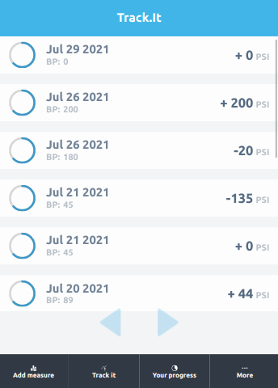
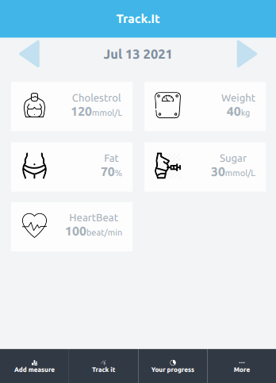

# Tracking App FrontEnd  

This project builds the a front end React app for Tracking users' health by setting goals and taking measurements of the essential health indicators.
The webapp has 6 main pages:
- `Login` and `Logout` Pages
- `MeasurementForm` Page which has a from to input measurement 
- `TrackPage` to see measureds summary of same measuremement kind 
- `MeasuredsByDatePage` Page which displays daily measurements
- `ProgressPage` which displays detail progress made by users, of a measurement type
- `MorePage` which has nav list to link to GoalFoam page and Logout
- `GoalFormPage` which has a form to set goal

## Pages and fnunctionalities

### HomePage

- The home page is the first landing page of the app. It presents app introduction and a header nav with links to HomePage itself, LoginPage and SignupPage.
### LoginPage

- The login page has a login form. Signed up users can login. Users can login only with their registered username.
- Error messages: 
    - `username invalid` will be rendered if unregistered user tries to login.
    - `Network error` will be displayed if there is a connection problem
### SignupPage

- The signup page has a signup form. Users can sign up only providing username which is not taken.
- Error messages: 
    - `username invalid or taken` will be rendered if it is taken or of invalid format.
    - `Network error` will be displayed if there is a connection problem
### MeasurementPage

- The measurement page has an input field to enter the measured value by the user.
- There are two selector buttons to pick from a number of measurement types. The measurements are supposed to be created by an admin user, but the admin functionality is not implemented yet.
- If the user has not created a goal before, the measurement form will redirect the user to the goal form page.
### TrackPage

- The track page displays the list of all measureds by the user for a kind of measurement. The user can navigate through measured lists of various measurement types using selector buttons. 
- Each measured list item has a link which redirects to the measuredsByDate page which displays measureds of different measurement types corresponding to the date of the selected measured list. 
### MeasuredsByDatePage

- This page displays all the measureds list corresponding to a particular day. 
- The user can navigate through differnt measured lists filtered by date using selector buttons.
- The measured list items in this page are linked to Progress page, which displays detailed progress data for a measurement kind. 
### ProgressPage
  
- The progress page displays detailed data of the user's progress based on the goal set and the records of measureds. It has both numerical and graphical displays for better user experience. 
- It has selector buttons to navigate through progresses of various measurement kinds. 
### MorePage

- The More page has nav links to various pages. For now only the goalForm and logout nav links are implemented. 
### GoalFormPage

- The goal form page has a form with input fields to create a goal: quantity, day_one and day_last. 
- The user cannot create duplicate goals with same measurement kind.
- Error messages:
    - `Cannot create goal. Goal exists!` will be displayed if the user tries to create a duplicate goal with same measurement kind.
- Success messages:
    - `Goal successfully created` will be displayed if success response is returned after goal is successfully created.
### FooterNav
- The footer nav component is at the top level in app.js. The footer nav links redirect to the corresponding main pages: Measurement, Track, Progress and More.

### Authentication
- The app uses JWT authentication token to authorize logged in user. The top level component(App), requires auto_login, which returns JWT authentiation token, which makes the app deny service for unauthorized user. 

## Languages, tools and frameworks
- `Node.js` | `React` | `React-DOM` | `React-Create-App` | `Hooks` | `Routes` 
- `Redux` | `MiidleWares` | `Backend API` | `npm` | `CSS` | `ES6` 

## Live demo [Heroku]
[tracking-app-react](https://tracking-app-react1.herokuapp.com/)

## Backend API repo
[tracking-app-api](https://github.com/henatan99/tracking-app-api)

## Getting Started
This project was bootstrapped with [Create React App](https://github.com/facebook/create-react-app).
To get a local copy up and running, please follow the below steps. 

### Prerequisites

- Node.JS
- React

### SetUp 
- Clone the repository 
`git clone git@github.com:henatan99/tracking-app-react.git`

- cd to the project directory 
`cd tracking-app-react`

- Install dependancies 
`npm install`

- And follow the App Usage instructions in the next section

### `npm start`

Runs the app in the development mode.\
Open [http://localhost:3000](http://localhost:3000) to view it in the browser.

The page will reload if you make edits.\
You will also see any lint errors in the console.

### `npm test`

Launches the test runner in the interactive watch mode.\
See the section about [running tests](https://facebook.github.io/create-react-app/docs/running-tests) for more information.

### `yarn build`

Builds the app for production to the `build` folder.\
It correctly bundles React in production mode and optimizes the build for the best performance.

### Usage
Either run the app in local server after setting it up or just go to the live demo and sign up as a new user. Then, enjoy all the services of the app as an authorized user and take a good care of your health nby tracking the essential indicators.

## Authors

👤 **Henok Mossissa**

- GitHub: [@henatan99](https://github.com/henatan99)
- Twitter: [@henatan99](https://twitter.com/henatan99)
- LinkedIn: [Henok Mossissa](https://www.linkedin.com/in/henok-mekonnen-2a251613/)

## :handshake: Contributing

Contributions, issues, and feature requests are welcome!

## Show your support

Give a :star:️ if you like this project!

## Acknowledgment 

- Facebook team who created creat-react-app API 
- [Behance](www.behance.net) for cool design references 

## :memo: License

This project is [MIT](./LICENSE) licensed.